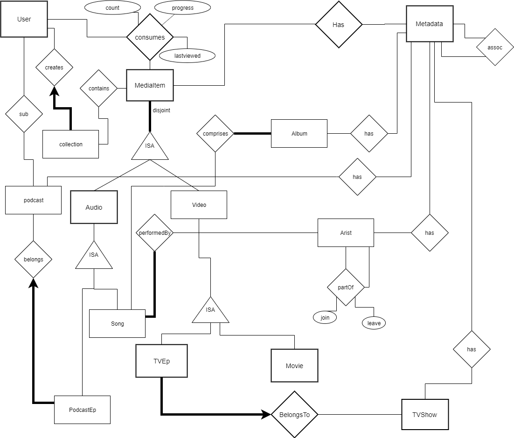

# 2020 S2 ISYS2120 - DB Application Programming Assignment

Welcome to assignment 03 for ISYS2120.

This is the code base that you must modify for the purposes of the assignment.

Please look at the specification [file](isys2120_20s2_a03_specification.pdf) to see the full details regarding what you need to do for this assessment.

You will have to mainly have to modify 2 files: routes.py and database.py

You will also have to modify some templates in the 'templates/*.html' folder

## Task Outline

The media server is designed to keep track of files and metadata information regarding
various audio and video media.

### Schema Description

As per the above schema you have various consumable media:

1. Movies
1. TV Shows (which have TV Episodes)
1. Songs (which are performed by Artists and appear in Albums)
1. Podcasts (which have Podcast Episodes)

There is also some User Account information which contains information about the user
including:

1. Contact Methods
1. Username / password
1. Subscribed podcasts
1. Consumed media

We have abstracted most of the common elements such descriptions, artwork and genres
into a MetaData table system. The primary Metadata table contains 3 fields:

1. an ID field (which other tables use a FK)
1. a MetaData type ID field (which maps to the MetaDataType table)
1. an actual value for the metadata

Presently, there are 4 possible types of metadata:

1. Song Genre
1. Film Genre
1. Artwork
1. Description

### Tasklist

You can find all the functions that you need to work on by looking for a 'TODO' comment in the code.

We have provided fully implemented functions and features that you can adapt to complete your tasks.

#### SQL Tasks

Your first task is to complete the 10 missing SQL queries in ’database.py’
They are as follows:

1. A user logs into the system by providing their username and password. Once logged in, they reach the landing page which displays:

    1. User subscribed Podcasts
    1. User Playlists
    1. User current in-progress items
1. When a user clicks on a song, they should see all the song information, including:

    1. Song Name
    2. Song Artists
    2. Song length
    2. Song Metadata such as Artwork, description, Genres
1. When a user clicks on the ’tv shows’ nav item, they should see a list of all tv shows information, including:
    
    1. TV Show ID
    2. TV Show Name
    2. Total number of tv show episodes for this tv show
1. When a user clicks on a single tv Show, they should see a list of relevant information, including:

    1. TV Show Name
    2. TV Show Metadata such as Artworks, Descriptions, Genres
    2. A list of every episode for this tv show ordered by Season and then Episode including:
        
        1. TV Show Episode ID
        3. TV Show Episode Title
        3. Season
        3. Episode
        3. AirDate
1. When a user clicks on a single Album, they should see a list of relevant information, including:

    1. Album Name
    2. Album Metadata such as Artworks, Descriptions
    2. A list of all songs in an album ordered by track number including:

        1. the song ID
        3. the Song Name
        3. The Song Artist(s)
1. Users should also be able to see all the genres for an Album in part 2.. The Genres for an album are composed of all the Genres for it’s songs.
1. When a user clicks on a single podcast from the ’podcasts’ list (or their subscribed podcasts), they should see a list of relevant information including:

    1. Podcast ID
    2. Podcast Name
    2. Podcast URI
    2. Last Updated
    2. Podcast Metadata such as Artworks, Descriptions, Genres
    2. A list of all podcast episodes in this podcast ordered by descending publication date including:

        1. Podcast Episode ID
        3. Podcast Episode Title
        3. Podcast Episode URI
        3. Podcast Episode Date Published
        3. Podcast Episode Length
1. When A user clicks on a single podcast episode from the list in part 7, they should see all relevant podcast episode information including:

    1. Podcast Episode ID
    2. Podcast Episode Title
    2. Podcast Episode URI
    2. Podcast Episode Date Published
    2. Podcast Episode Length
    2. Podcast Episode Metadata such as Artworks, Descriptions, Genres
1. Write the SQL to ensure the proper insert of a new Song, including valid artist checks and appropriate MetaData inserts. You may need to complete the function addSong() in the schema.sql file and reload the schema.sql file (or just run just that create statement)
1. Write SQL for getting all relevant details for searching through all movies by title

#### Data handling tasks

Your second task set is to complete the data handling for the last 4 SQL tasks from above.

You must complete the following functions in ’routes.py’:

1. single_podcast()
1. single_podcastep()
1. add_song()
1. search_movies()

You can write as many helper functions to assist you as you wish, just remember to
document them in your report.

#### Data Representation tasks

Your third task set is to complete the data representation for the last 4 tasks in the SQL tasks.

You must complete the following files in the 'templates' folder:

1. 'templates/singleitems/podcast.html'
1. 'templates/singleitems/podcastep.html'
1. 'templates/createitems/createsong.html'
1. 'templates/searchitems/search movies.html’ and add a link to ’templates/top.html’ enabling the drop-down option to search by movies

#### New functionality

Your fourth task is to create a new functionality. This will usually involve the following:

1. Create a new function(s) in 'routes.py' to handle the new route and handle data
flow.
1. Create a new function(s) in 'database.py' or new functions in SQL.
1. Create a new template(s) in 'templates/*.html'.
1. Add new Menu items to 'templates/top.html' or links in other existing files to
access your new routes